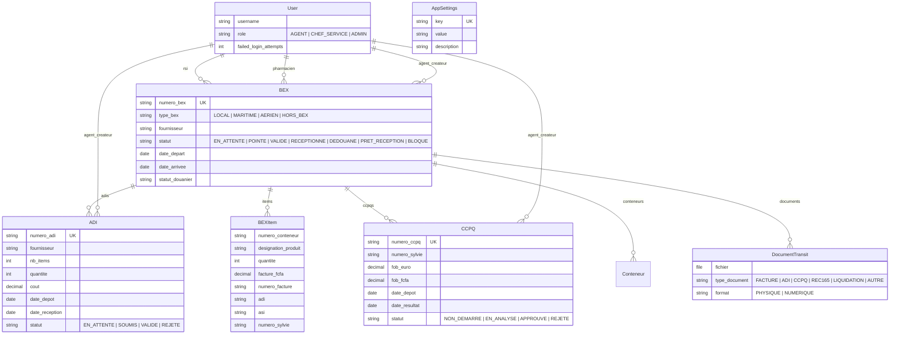

# 📚 Documentation du Projet — Gestion & Suivi Documentaire (Laborex Transit)

> **Version** : 1.0  
> **Date** : 1er Juin 2026  
> **Stack** : Django 5.1 · Django REST Framework · SQLite/PostgreSQL · Pandas · WhiteNoise  
> **Déploiement** : Render.com  
> **Frontend associé** : Application React (hébergée sur Vercel)

---

## 📖 Table des matières

1. [Présentation du projet](#1--présentation-du-projet)
2. [Architecture globale](#2--architecture-globale)
3. [Arborescence des fichiers](#3--arborescence-des-fichiers)
4. [Description des applications Django](#4--description-des-applications-django)
5. [Modèles de données](#5--modèles-de-données)
6. [Système de rôles et permissions](#6--système-de-rôles-et-permissions)
7. [Endpoints API](#7--endpoints-api)
8. [Scripts utilitaires](#8--scripts-utilitaires)
9. [Déploiement](#9--déploiement)
10. [Dépendances](#10--dépendances)

---

## 1 — Présentation du projet

**Gestion & Suivi Documentaire** est une API backend Django conçue pour **Laborex Burkina Faso**. Elle permet le suivi complet du cycle de transit des marchandises pharmaceutiques, depuis la création d'un dossier BEX jusqu'au dédouanement et à la réception finale.

### Fonctionnalités principales

- **Gestion des dossiers BEX** (Bons d'Expédition) : création, suivi de statut, upload de documents, validation
- **Gestion des ADI** (Autorisations de Dédouanement à l'Importation) : CRUD complet + import Excel
- **Gestion des CCPQ** (Certificats de Contrôle et de Qualité Pharmaceutique) : CRUD complet + import Excel
- **Dashboard analytique** : KPIs en temps réel, graphiques, détection des retards
- **Intégration Power BI** : endpoint d'embedding pour rapports visuels avancés
- **Export Excel** : téléchargement de rapports de synthèse
- **Gestion des utilisateurs** : authentification par session, rôles (Agent, Chef de Service, Admin/RSI), verrouillage automatique après 5 tentatives échouées

---

## 2 — Architecture globale

```
┌─────────────────────────────────────────────────────┐
│                  Frontend React (Vercel)             │
└──────────────────────┬──────────────────────────────┘
                       │  REST API (JSON)
┌──────────────────────▼──────────────────────────────┐
│               Django Backend (Render)                │
│                                                      │
│  ┌──────────┐ ┌──────────┐ ┌───────────┐ ┌────────┐│
│  │  users   │ │ transit  │ │ analytics │ │  core  ││
│  │(Auth/RBAC)│ │(BEX/ADI/ │ │(Dashboard/│ │(Config)││
│  │          │ │ CCPQ/Doc)│ │ PowerBI)  │ │        ││
│  └──────────┘ └──────────┘ └───────────┘ └────────┘│
│                                                      │
│  ┌──────────────────────────────────────────────────┐│
│  │         SQLite (dev) / PostgreSQL (prod)          ││
│  └──────────────────────────────────────────────────┘│
└──────────────────────────────────────────────────────┘
```

Le projet est organisé en **5 applications Django** : `core`, `users`, `transit`, `analytics` et `processing` (réservée).

---

## 3 — Arborescence des fichiers

```
Gestion_Suivi_Documentaire/
│
├── manage.py                          # Point d'entrée Django
├── requirements.txt                   # Dépendances Python
├── build.sh                           # Script de build pour Render
├── db.sqlite3                         # Base de données SQLite locale
├── Database                           # Fichier de base de données (backup)
├── .gitignore                         # Fichiers ignorés par Git
│
├── Gestion_Suivi_Documentaire/        # Configuration Django (projet)
│   ├── __init__.py                    # Package Python
│   ├── settings.py                    # Configuration principale Django
│   ├── urls.py                        # Routage URL principal
│   ├── wsgi.py                        # Point d'entrée WSGI (production)
│   └── asgi.py                        # Point d'entrée ASGI (async)
│
├── core/                              # App : configuration globale
│   ├── __init__.py
│   ├── apps.py                        # Config de l'app Django
│   ├── models.py                      # Modèle AppSettings (paramètres clé/valeur)
│   ├── views.py                       # Vue index (page d'accueil template)
│   ├── views_api.py                   # API REST pour AppSettings (CRUD admin)
│   ├── authentication.py             # Auth session sans vérification CSRF
│   ├── admin.py                       # Admin Django (vide)
│   ├── tests.py                       # Tests (vide)
│   └── templates/
│       └── index.html                 # Template HTML d'accueil
│
├── users/                             # App : gestion des utilisateurs
│   ├── __init__.py
│   ├── apps.py                        # Config + chargement des signaux
│   ├── models.py                      # Modèle User personnalisé (AbstractUser + rôles)
│   ├── views.py                       # Vues : login, logout, me, users CRUD, unlock
│   ├── urls.py                        # Routes : /api/login/, /api/me/, /api/users/
│   ├── permissions.py                 # Classes de permissions RBAC (DRF)
│   ├── signals.py                     # Signaux : verrouillage après 5 échecs de login
│   ├── admin.py                       # Admin Django (vide)
│   └── tests.py                       # Tests (vide)
│
├── transit/                           # App : gestion des dossiers de transit
│   ├── __init__.py
│   ├── apps.py                        # Config + chargement des signaux
│   ├── models.py                      # Modèles : BEX, BEXItem, Conteneur, ADI, CCPQ, DocumentTransit
│   ├── views.py                       # ViewSets : BEX, ADI, CCPQ (CRUD + import Excel)
│   ├── serializers.py                 # Sérialiseurs DRF pour tous les modèles transit
│   ├── urls.py                        # Routes : /api/transit/bex|adi|ccpq/
│   ├── signals.py                     # Signaux : mise à jour auto du statut BEX
│   ├── admin.py                       # Admin Django (vide)
│   ├── tests.py                       # Tests (vide)
│   └── README.md                      # Documentation spécifique transit
│
├── analytics/                         # App : tableau de bord et rapports
│   ├── __init__.py
│   ├── apps.py                        # Config de l'app
│   ├── models.py                      # (Vide — utilise les modèles transit)
│   ├── views.py                       # APIs : Dashboard, Power BI Embed, Export Excel
│   ├── dashboard_logic.py            # Logique métier du dashboard (KPIs, graphiques)
│   ├── urls.py                        # Routes : /api/analytics/dashboard-data|powerbi-embed|export-excel/
│   ├── admin.py                       # Admin Django (vide)
│   └── tests.py                       # Tests (vide)
│
├── processing/                        # App : réservée pour traitements futurs
│   ├── __init__.py
│   ├── apps.py
│   ├── models.py                      # (Vide)
│   ├── views.py                       # (Vide)
│   ├── admin.py
│   └── tests.py
│
├── media/transit/                     # Fichiers uploadés (documents de transit)
│
├── populate_dashboard_data.py         # Script : peuplement de données de test réalistes
├── setup_test_users.py                # Script : création des utilisateurs de test
├── test_views.py                      # Script : tests d'intégration des APIs
└── Postman_Collection.json            # Collection Postman pour tester l'API
```

---

## 4 — Description des applications Django

### 4.1 `core` — Configuration globale

| Fichier | Rôle |
|---------|------|
| `models.py` | Modèle **AppSettings** : stockage clé/valeur pour les paramètres globaux de l'application (ex. seuils, configurations RSI) |
| `views.py` | Vue `index` : rendu du template HTML d'accueil |
| `views_api.py` | **AppSettingsViewSet** : API REST CRUD pour les paramètres. Lecture pour tous les authentifiés, écriture réservée à l'Admin (RSI) |
| `authentication.py` | **CsrfExemptSessionAuthentication** : classe d'authentification par session qui désactive la vérification CSRF, nécessaire pour le frontend React cross-domain |

### 4.2 `users` — Authentification et gestion des utilisateurs

| Fichier | Rôle |
|---------|------|
| `models.py` | Modèle **User** personnalisé (hérite de `AbstractUser`). Ajoute un champ `role` (AGENT, CHEF_SERVICE, ADMIN) et `failed_login_attempts` |
| `views.py` | **5 vues** : `login_view` (authentification JSON), `logout_view`, `me_view` (profil courant), `users_list_create_view` (CRUD admin), `unlock_user_view` (débloquer un compte) |
| `urls.py` | Routes : `/api/login/`, `/api/logout/`, `/api/me/`, `/api/users/`, `/api/users/unlock/` |
| `permissions.py` | **4 classes de permissions** : `IsAgentTransit`, `IsChefService`, `IsAdminRSI`, `CanManageTransit` (permission avancée avec contrôle objet). Fonction utilitaire `get_visible_objects` pour filtrer selon le rôle |
| `signals.py` | **2 signaux** : `track_failed_login` (incrémente les échecs, bloque après 5) et `reset_failed_login` (remet à zéro après connexion réussie) |

### 4.3 `transit` — Gestion des dossiers de transit

| Fichier | Rôle |
|---------|------|
| `models.py` | **6 modèles** : `BEX` (bon d'expédition, 7 statuts possibles), `BEXItem` (lignes factures d'un BEX), `Conteneur`, `ADI` (autorisation de dédouanement, 4 statuts), `CCPQ` (certificat qualité, 4 statuts), `DocumentTransit` (fichiers uploadés avec type et format). Inclut un signal inline pour la mise à jour automatique du statut BEX |
| `views.py` | **3 ViewSets** : `BEXViewSet` (CRUD + dossier complet + upload doc + validation + import Excel), `ADIViewSet` (CRUD + import Excel), `CCPQViewSet` (CRUD + import Excel). Chaque ViewSet gère l'import de fichiers Excel avec parsing dynamique des colonnes via Pandas |
| `serializers.py` | **6 sérialiseurs** : `BEXSerializer` (avec items imbriqués), `BEXDossierCompletSerializer` (vue complète avec items, conteneurs, ADIs, CCPQs, documents), `BEXItemSerializer`, `ADISerializer`, `CCPQSerializer`, `DocumentTransitSerializer` |
| `urls.py` | Router DRF : `/api/transit/bex/`, `/api/transit/adi/`, `/api/transit/ccpq/` |
| `signals.py` | Signal `update_bex_status_on_document_upload` : change automatiquement le statut du BEX en DEDOUANE (Liquidation) ou PRET_RECEPTION (REC165) lors de l'upload d'un document |

### 4.4 `analytics` — Dashboard et rapports

| Fichier | Rôle |
|---------|------|
| `views.py` | **3 vues API** : `DashboardDataAPIView` (agrégation des KPIs avec sécurité par rôle), `PowerBIEmbedAPIView` (token d'embedding Power BI réel ou mock), `ExportExcelAPIView` (téléchargement du rapport Excel) |
| `dashboard_logic.py` | **Cœur métier du dashboard**. Fonctions : `calculate_dashboard_metrics` (calcule dossiers actifs, retards, délais moyens, taux de validation, graphiques barres/pie/tendance), `generate_excel_report` (génère un fichier Excel en mémoire avec 3 feuilles). Seuils SLA : BEX=15j, ADI=5j, CCPQ=7j |
| `urls.py` | Routes : `/api/analytics/dashboard-data/`, `/api/analytics/powerbi-embed/`, `/api/analytics/export-excel/` |

### 4.5 `processing` — Réservée

Application vide prévue pour de futurs traitements automatisés.

---

## 5 — Modèles de données



---

## 6 — Système de rôles et permissions

| Rôle | Code | Droits |
|------|------|--------|
| **Agent Transit** | `AGENT` | Créer/modifier **ses propres** dossiers BEX, ADI, CCPQ. Uploader des documents. Ne voit que ses données sur le dashboard |
| **Chef de Service** | `CHEF_SERVICE` | Voir et modifier **tous** les dossiers. Valider les dossiers BEX. Accès dashboard global |
| **Administrateur RSI** | `ADMIN` | Lecture seule sur les dossiers métier (ne peut pas créer/modifier). Gère les utilisateurs (création, déblocage). Modifie les paramètres AppSettings. Accès dashboard global |

### Sécurité

- **Verrouillage de compte** : après 5 tentatives de login échouées, le compte est automatiquement désactivé (`is_active = False`)
- **Sessions** : expiration après 30 minutes d'inactivité, réinitialisée à chaque requête
- **CORS** : configuré pour accepter les requêtes du frontend React (Vercel)
- **CSRF** : désactivé pour l'authentification session (nécessaire pour le cross-domain)

---

## 7 — Endpoints API

### Authentification

| Méthode | Endpoint | Description |
|---------|----------|-------------|
| `POST` | `/api/login/` | Connexion (username + password en JSON) |
| `POST` | `/api/logout/` | Déconnexion |
| `GET` | `/api/me/` | Profil de l'utilisateur connecté |
| `GET/POST` | `/api/users/` | Liste / Création d'utilisateurs (Admin uniquement) |
| `POST` | `/api/users/unlock/` | Débloquer un compte verrouillé (Admin uniquement) |

### Transit

| Méthode | Endpoint | Description |
|---------|----------|-------------|
| `GET/POST` | `/api/transit/bex/` | Liste / Création de dossiers BEX |
| `GET/PUT/DELETE` | `/api/transit/bex/{id}/` | Détail / Modification / Suppression d'un BEX |
| `GET` | `/api/transit/bex/{id}/dossier-complet/` | Vue complète du dossier (items, docs, ADIs, CCPQs) |
| `POST` | `/api/transit/bex/{id}/upload-document/` | Upload de document (multipart) |
| `POST` | `/api/transit/bex/{id}/valider/` | Validation par le Chef de Service |
| `POST` | `/api/transit/bex/import-excel/` | Import Excel de BEX avec items |
| `GET/POST` | `/api/transit/adi/` | Liste / Création de dossiers ADI |
| `POST` | `/api/transit/adi/import-excel/` | Import Excel de dossiers ADI |
| `GET/POST` | `/api/transit/ccpq/` | Liste / Création de dossiers CCPQ |
| `POST` | `/api/transit/ccpq/import-excel/` | Import Excel de dossiers CCPQ |

### Analytics

| Méthode | Endpoint | Paramètres | Description |
|---------|----------|------------|-------------|
| `GET` | `/api/analytics/dashboard-data/` | `agent_id`, `periode`, `type_dossier` | Métriques du dashboard (KPIs, graphiques) |
| `GET` | `/api/analytics/powerbi-embed/` | `fallback_mock` | Configuration d'embedding Power BI |
| `GET` | `/api/analytics/export-excel/` | `agent_id`, `periode`, `type_dossier` | Téléchargement du rapport Excel |

### Configuration

| Méthode | Endpoint | Description |
|---------|----------|-------------|
| `GET/POST/PUT/DELETE` | `/api/settings/` | CRUD paramètres globaux (écriture Admin uniquement) |

---

## 8 — Scripts utilitaires

| Script | Commande | Description |
|--------|----------|-------------|
| `setup_test_users.py` | `python setup_test_users.py` | Crée 3 utilisateurs de test : `admin` (RSI), `agent1` (Transit), `chef1` (Validation) |
| `populate_dashboard_data.py` | `python populate_dashboard_data.py` | Peuple la base avec des données réalistes (7 BEX, 5 ADI, 5 CCPQ, items, conteneurs, documents) pour tester le dashboard |
| `test_views.py` | `python test_views.py` | Tests d'intégration : vérifie les endpoints dashboard, filtres, Power BI |
| `build.sh` | Exécuté par Render | Script de déploiement : installe les dépendances, collecte les fichiers statiques, migre la DB, crée les utilisateurs de test |

---

## 9 — Déploiement

### Environnement local

```bash
# 1. Créer l'environnement virtuel
python -m venv env
source env/bin/activate

# 2. Installer les dépendances
pip install -r requirements.txt

# 3. Appliquer les migrations
python manage.py migrate

# 4. Créer les utilisateurs de test
python setup_test_users.py

# 5. (Optionnel) Peupler les données de démonstration
python populate_dashboard_data.py

# 6. Lancer le serveur
python manage.py runserver
```

### Déploiement Render

- **URL de production** : `https://gestion-suivi-documentaire.onrender.com`
- **Build Command** : `./build.sh`
- **Start Command** : `gunicorn Gestion_Suivi_Documentaire.wsgi`
- **Base de données** : SQLite par défaut, PostgreSQL si `DATABASE_URL` est configurée

### Variables d'environnement (optionnelles)

| Variable | Description |
|----------|-------------|
| `SECRET_KEY` | Clé secrète Django |
| `DEBUG` | `True` ou `False` |
| `DATABASE_URL` | URL PostgreSQL (active auto le switch depuis SQLite) |
| `POWERBI_CLIENT_ID` | Azure AD Client ID pour Power BI |
| `POWERBI_CLIENT_SECRET` | Azure AD Client Secret |
| `POWERBI_TENANT_ID` | Azure AD Tenant ID |
| `POWERBI_WORKSPACE_ID` | Power BI Workspace ID |
| `POWERBI_REPORT_ID` | Power BI Report ID |

---

## 10 — Dépendances

| Package | Version | Utilisation |
|---------|---------|-------------|
| `django` | ≥ 5.1.1 | Framework web principal |
| `djangorestframework` | latest | API REST |
| `django-filter` | latest | Filtrage des querysets via URL |
| `django-cors-headers` | latest | Support CORS pour le frontend React |
| `pandas` | latest | Parsing des fichiers Excel importés |
| `openpyxl` | latest | Moteur Excel pour Pandas (lecture/écriture .xlsx) |
| `psycopg2-binary` | latest | Driver PostgreSQL |
| `gunicorn` | latest | Serveur WSGI de production |
| `whitenoise` | latest | Serveur de fichiers statiques |
| `dj-database-url` | latest | Parsing de DATABASE_URL |
| `python-dotenv` | latest | Chargement de variables d'environnement |
| `requests` | latest | Appels HTTP vers l'API Power BI Azure |

---

## 🔑 Comptes de test par défaut

| Utilisateur | Mot de passe | Rôle |
|-------------|-------------|------|
| `admin` | `admin123` | Administrateur RSI |
| `agent1` | `agent123` | Agent Transit |
| `chef1` | `chef123` | Chef de Service (Validation) |

---

> **Note** : Ce backend est conçu pour fonctionner avec un frontend React séparé, hébergé sur Vercel (`laborex-front-45of.vercel.app`). L'API utilise l'authentification par session avec exemption CSRF pour permettre la communication cross-domain.
